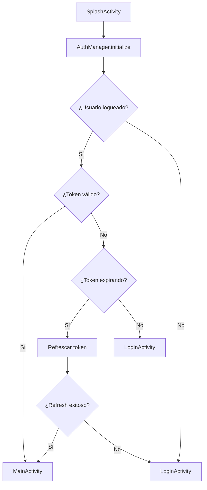
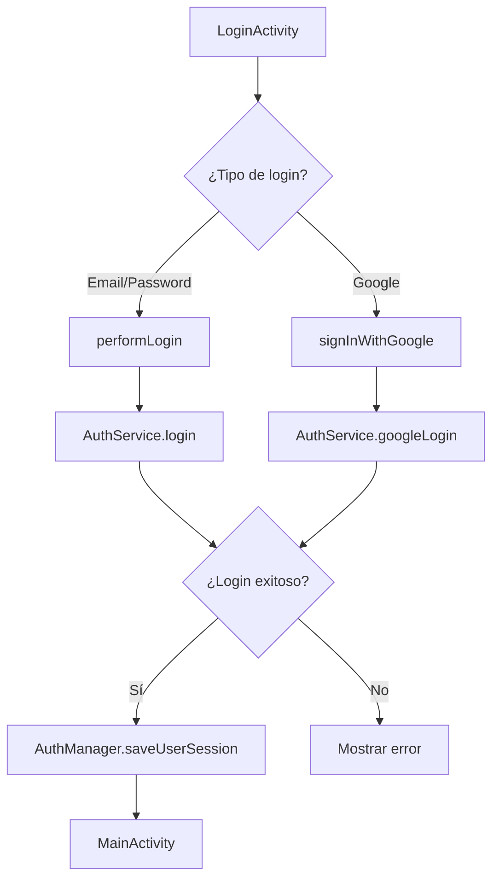
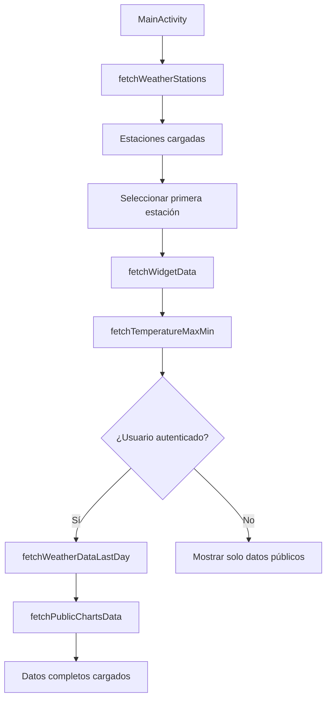
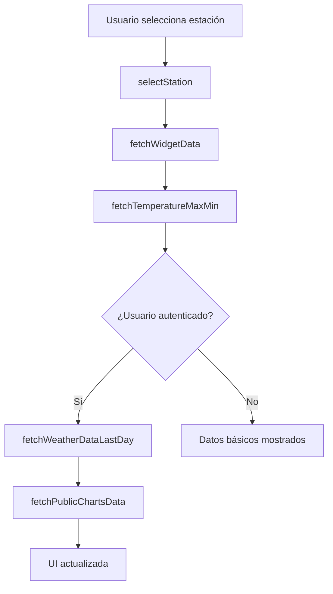

# 📋 Documentación Técnica - RAF App

## 📑 Índice

1. [Información General](#información-general)
2. [Arquitectura de la Aplicación](#arquitectura-de-la-aplicación)
3. [Integración con Backend](#integración-con-backend)
4. [Sistema de Autenticación](#sistema-de-autenticación)
5. [Modelos de Datos](#modelos-de-datos)
6. [Servicios de Red](#servicios-de-red)
7. [Gestión de Estado](#gestión-de-estado)
8. [Flujos de Usuario](#flujos-de-usuario)
9. [Configuración y Build](#configuración-y-build)
10. [Mejores Prácticas Implementadas](#mejores-prácticas-implementadas)
11. [Troubleshooting](#troubleshooting)

---

## 📱 Información General

### **Descripción del Proyecto**
**RAF App** es una aplicación móvil Android desarrollada en Kotlin para el monitoreo de la Red Agrometeorológica de Formosa. La aplicación permite visualizar datos meteorológicos en tiempo real, históricos y pronósticos de estaciones meteorológicas distribuidas en la provincia de Formosa.

### **Tecnologías Principales**
- **Lenguaje**: Kotlin
- **Arquitectura**: MVVM (Model-View-ViewModel)
- **Networking**: Retrofit2 + OkHttp
- **Async Programming**: Kotlin Coroutines
- **UI**: Android Views + LiveData
- **Security**: EncryptedSharedPreferences
- **Authentication**: Google Sign-In + JWT

### **Versión Actual**
- **Versión**: 1.5.0
- **API Base URL**: `https://ramf.formosa.gob.ar/api/http/`
- **API Documentation**: `https://ramf.formosa.gob.ar/api/http/docs/`

---

## 🏗️ Arquitectura de la Aplicación

### **Patrón MVVM Implementado**

```
┌─────────────────┐    ┌──────────────────┐    ┌─────────────────┐
│   Activities    │    │   ViewModels     │    │   Repositories  │
│   Fragments     │◄──►│   (LiveData)     │◄──►│   (Data Layer)  │
│   (UI Layer)    │    │   (Business)     │    │                 │
└─────────────────┘    └──────────────────┘    └─────────────────┘
                                                         │
                                                         ▼
                                               ┌─────────────────┐
                                               │   Network Layer │
                                               │   (Retrofit)    │
                                               └─────────────────┘
```

### **Estructura de Paquetes**

```
com.cocido.ramfapp/
├── ui/
│   ├── activities/           # Activities principales
│   │   ├── MainActivity.kt
│   │   ├── LoginActivity.kt
│   │   ├── SplashActivity.kt
│   │   └── MapActivity.kt
│   └── fragments/            # Fragments (si los hay)
├── viewmodels/              # ViewModels con lógica de negocio
│   └── WeatherStationViewModel.kt
├── models/                  # Modelos de datos
│   ├── User.kt
│   ├── LoginResponse.kt
│   ├── WeatherStation.kt
│   ├── WidgetData.kt
│   ├── ApiResponse.kt
│   └── ...
├── network/                 # Capa de red
│   ├── RetrofitClient.kt
│   ├── AuthService.kt
│   └── WeatherStationService.kt
├── repository/              # Repositorios de datos
│   └── WeatherRepository.kt
└── utils/                   # Utilidades y helpers
    ├── AuthManager.kt
    └── AuthHelper.kt
```

---

## 🌐 Integración con Backend

### **URL Base de la API**
```
Base URL: https://ramf.formosa.gob.ar/api/http/
```

### **Endpoints Disponibles**

#### **🔓 Endpoints Públicos (No requieren autenticación)**

| Endpoint | Método | Descripción | Parámetros |
|----------|--------|-------------|------------|
| `/auth/login` | POST | Login con email/contraseña | `LoginRequest` |
| `/auth/register` | POST | Registro de usuario | `RegisterRequest` |
| `/auth/login/google` | POST | Login con Google | `GoogleTokenRequest` |
| `/stations` | GET | Lista de estaciones | - |
| `/stations/geo` | GET | Estaciones con datos geográficos | - |
| `/stations/{stationName}` | GET | Estación específica | `stationName` |
| `/sensors` | GET | Lista de sensores | - |
| `/stations-measurement/widget/{stationName}` | GET | Datos del widget | `stationName` |

#### **🔐 Endpoints Protegidos (Requieren accessToken)**

| Endpoint | Método | Descripción | Parámetros |
|----------|--------|-------------|------------|
| `/auth/logout` | POST | Cerrar sesión | Header: `Authorization` |
| `/auth/refresh` | POST | Refrescar token | Header: `Authorization` |
| `/auth/verify` | GET | Verificar token | Header: `Authorization` |
| `/stations-measurement/data-time-range/{stationName}` | GET | Datos por rango de tiempo | `stationName`, `from`, `to` |
| `/stations-measurement/data-time-range-charts/{stationName}` | GET | Datos para gráficos | `stationName`, `from`, `to` |
| `/stations-measurement/allByStationName/{stationName}` | GET | Todos los datos de estación | `stationName` |
| `/stations-measurement/data-from-to/{stationName}` | GET | Datos entre fechas | `stationName`, `from`, `to` |

### **⚠️ Endpoints NO Disponibles (404 Not Found)**
```
❌ /stations-measurement/public/data/{stationName}
❌ /stations-measurement/public-charts/{stationName}
```

### **Headers de Autenticación**
```http
Authorization: Bearer {accessToken}
Content-Type: application/json
```

---

## 🔐 Sistema de Autenticación

### **Flujo de Autenticación**

#### **1. Login Normal (Email/Password)**
```kotlin
// Request
{
    "email": "usuario@ejemplo.com",
    "password": "password123"
}

// Response
{
    "accessToken": "eyJhbGciOiJIUzI1NiIsInR5cCI6IkpXVCJ9...",
    "refreshToken": "eyJhbGciOiJIUzI1NiIsInR5cCI6IkpXVCJ9...",
    "user": {
        "id": "user123",
        "email": "usuario@ejemplo.com",
        "firstName": "Juan",
        "lastName": "Pérez",
        "role": "user"
    }
}
```

#### **2. Login con Google**
```kotlin
// Request
{
    "email": "usuario@gmail.com",
    "name": "Juan",
    "lastName": "Pérez",
    "avatar": "https://lh3.googleusercontent.com/...",
    "google_id": "123456789",
    "idToken": "eyJhbGciOiJSUzI1NiIsInR5cCI6IkpXVCJ9..."
}

// Response (mismo formato que login normal)
```

### **Gestión de Tokens**

#### **AuthManager.kt**
```kotlin
object AuthManager {
    // Almacenamiento seguro con EncryptedSharedPreferences
    fun saveUserSession(user: User, loginResponse: LoginResponse)
    fun getAccessToken(): String?
    fun getRefreshToken(): String?
    fun isUserLoggedIn(): Boolean
    fun isTokenExpiringSoon(): Boolean
    fun refreshTokenIfNeeded(): Boolean
    fun logout()
}
```

#### **AuthHelper.kt**
```kotlin
object AuthHelper {
    enum class AuthState {
        LOGGED_OUT,
        LOGGED_IN,
        TOKEN_EXPIRED,
        REFRESHING_TOKEN
    }
    
    fun isAuthenticated(): Boolean
    fun refreshTokenIfNeeded(): Boolean
    fun getAuthErrorMessage(): String
}
```

### **Configuración de Google Sign-In**

#### **google-services.json**
```json
{
    "project_info": {
        "project_id": "ramf-app-formosa"
    },
    "client": [
        {
            "client_info": {
                "android_client_info": {
                    "package_name": "com.cocido.ramfapp"
                }
            },
            "oauth_client": [
                {
                    "client_id": "965449421194-9c4p2k2bk6eb419p1o1airrdq1edasm5.apps.googleusercontent.com",
                    "client_type": 1
                },
                {
                    "client_id": "965449421194-9c4p2k2bk6eb419p1o1airrdq1edasm5.apps.googleusercontent.com",
                    "client_type": 3
                }
            ]
        }
    ]
}
```

#### **strings.xml**
```xml
<string name="default_web_client_id">965449421194-9c4p2k2bk6eb419p1o1airrdq1edasm5.apps.googleusercontent.com</string>
```

---

## 📊 Modelos de Datos

### **User.kt**
```kotlin
data class User(
    @SerializedName("id") val id: String,
    @SerializedName("first_name") val firstName: String,
    @SerializedName("last_name") val lastName: String,
    @SerializedName("email") val email: String,
    @SerializedName("avatar") val avatar: String? = null,
    @SerializedName("role") val role: String,
    @SerializedName("is_active") val isActive: Boolean = true,
    @SerializedName("created_at") val createdAt: String? = null,
    @SerializedName("updated_at") val updatedAt: String? = null,
    @SerializedName("permissions") val permissions: List<String>? = null
) {
    fun getFullName(): String = "$firstName $lastName".trim()
    fun hasPermission(permission: String): Boolean = permissions?.contains(permission) ?: false
    fun isAdmin(): Boolean = role.lowercase() == "admin" || hasPermission("admin")
}
```

### **LoginResponse.kt**
```kotlin
data class LoginResponse(
    @SerializedName("accessToken") val accessToken: String,
    @SerializedName("refreshToken") val refreshToken: String? = null,
    val user: User
) {
    fun getFullToken(): String = "Bearer $accessToken"
    fun isTokenExpiringSoon(): Boolean = false // Se puede mejorar con JWT parsing
    fun getExpiresIn(): Long = 1200000 // 20 minutos en milisegundos
}
```

### **WeatherStation.kt**
```kotlin
data class WeatherStation(
    @SerializedName("id") val id: String,
    @SerializedName("name") val name: String,
    @SerializedName("location") val location: String,
    @SerializedName("latitude") val latitude: Double,
    @SerializedName("longitude") val longitude: Double,
    @SerializedName("altitude") val altitude: Double,
    @SerializedName("status") val status: String,
    @SerializedName("lastCommunication") val lastCommunication: String?,
    @SerializedName("sensors") val sensors: List<String>? = null
)
```

### **WidgetData.kt**
```kotlin
data class WidgetData(
    @SerializedName("timestamp") val timestamp: String,
    @SerializedName("temperature") val temperature: Double,
    @SerializedName("max_temperature") val maxTemperature: Double,
    @SerializedName("min_temperature") val minTemperature: Double,
    @SerializedName("relative_humidity") val relativeHumidity: Double,
    @SerializedName("dew_point") val dewPoint: Double,
    @SerializedName("air_pressure") val airPressure: Double,
    @SerializedName("solar_radiation") val solarRadiation: Double,
    @SerializedName("wind_speed") val windSpeed: Double,
    @SerializedName("wind_direction") val windDirection: String,
    @SerializedName("rain_last_hour") val rainLastHour: Double,
    @SerializedName("rain_day") val rainDay: Double,
    @SerializedName("rain_24h") val rain24h: Double,
    @SerializedName("rain_48h") val rain48h: Double,
    @SerializedName("rain_7d") val rain7d: Double,
    @SerializedName("station_name") val stationName: String? = null,
    @SerializedName("data_quality") val dataQuality: String? = null,
    @SerializedName("last_update") val lastUpdate: String? = null
) {
    fun getFormattedTemperature(): String = "${String.format("%.1f", temperature)}°C"
    fun getFormattedHumidity(): String = "${String.format("%.1f", relativeHumidity)}%"
    fun getFormattedWindSpeed(): String = "${String.format("%.1f", windSpeed)} km/h"
    fun getFormattedPressure(): String = "${String.format("%.1f", airPressure)} hPa"
    fun getWindDirectionText(): String = when {
        windDirection.contains("N") -> "Norte"
        windDirection.contains("S") -> "Sur"
        windDirection.contains("E") -> "Este"
        windDirection.contains("W") -> "Oeste"
        windDirection.contains("NE") -> "Noreste"
        windDirection.contains("NW") -> "Noroeste"
        windDirection.contains("SE") -> "Sureste"
        windDirection.contains("SW") -> "Suroeste"
        else -> windDirection
    }
    fun isDataRecent(): Boolean {
        return try {
            val dateFormat = SimpleDateFormat("yyyy-MM-dd'T'HH:mm:ss.SSS'Z'", Locale.US)
            val dataTime = dateFormat.parse(timestamp)
            val currentTime = Date()
            val diffInMinutes = (currentTime.time - (dataTime?.time ?: 0)) / (1000 * 60)
            diffInMinutes < 60
        } catch (e: Exception) {
            false
        }
    }
}
```

### **ApiResponse.kt**
```kotlin
data class ApiResponse<T>(
    @SerializedName("success") val success: Boolean,
    @SerializedName("data") val data: T? = null,
    @SerializedName("message") val message: String? = null,
    @SerializedName("error") val error: ApiError? = null
)

data class ApiError(
    @SerializedName("code") val code: String,
    @SerializedName("message") val message: String,
    @SerializedName("details") val details: Map<String, List<String>>? = null
)
```

---

## 🌐 Servicios de Red

### **RetrofitClient.kt**

#### **Configuración Principal**
```kotlin
object RetrofitClient {
    private const val BASE_URL = BuildConfig.API_BASE_URL
    private var authToken: String? = null
    private var refreshToken: String? = null
    private var tokenExpiryTime: Long = 0
    
    fun setAuthTokens(accessToken: String?, refreshToken: String?, expiresIn: Long = 0)
    fun clearAuthTokens()
    fun <T> handleApiResponse(response: Response<ApiResponse<T>>): Result<T>
}
```

#### **Interceptores Implementados**

1. **AuthInterceptor**: Añade automáticamente el header `Authorization`
2. **ErrorInterceptor**: Maneja reintentos con backoff exponencial
3. **LoggingInterceptor**: Logs seguros (filtra información sensible)

#### **Endpoints Públicos Configurados**
```kotlin
val publicEndpoints = listOf(
    "/auth/login",
    "/auth/register", 
    "/auth/forgot-password",
    "/auth/reset-password",
    "/stations",
    "/stations/geo",
    "/stations/",
    "/sensors",
    "/stations-measurement/widget"
)
```

### **AuthService.kt**
```kotlin
interface AuthService {
    @POST("auth/login")
    suspend fun login(@Body request: LoginRequest): Response<ApiResponse<LoginResponse>>
    
    @POST("auth/login/google")
    suspend fun googleLogin(@Body googleToken: Map<String, String>): Response<LoginResponse>
    
    @POST("auth/logout")
    suspend fun logout(@Header("Authorization") token: String): Response<ApiResponse<Void>>
    
    @POST("auth/refresh")
    suspend fun refreshToken(@Header("Authorization") token: String): Response<ApiResponse<LoginResponse>>
    
    @GET("auth/verify")
    suspend fun verifyToken(@Header("Authorization") token: String): Response<ApiResponse<User>>
}
```

### **WeatherStationService.kt**
```kotlin
interface WeatherStationService {
    // Endpoints públicos
    @GET("stations")
    suspend fun getWeatherStations(): Response<StationsResponse>
    
    @GET("stations-measurement/widget/{stationName}")
    suspend fun getWidgetData(@Path("stationName") stationName: String): Response<ApiResponse<WidgetData>>
    
    // Endpoints protegidos
    @GET("stations-measurement/data-time-range/{stationName}")
    suspend fun getWeatherDataTimeRange(
        @Path("stationName") stationName: String,
        @Query("from") from: String,
        @Query("to") to: String,
        @Query("time_range") timeRange: String = "custom"
    ): Response<ApiResponse<List<WeatherData>>>
    
    @GET("stations-measurement/data-time-range-charts/{stationName}")
    suspend fun getWeatherDataForCharts(
        @Path("stationName") stationName: String,
        @Query("from") from: String,
        @Query("to") to: String,
        @Query("time_range") timeRange: String = "custom"
    ): Response<ApiResponse<List<WeatherData>>>
}
```

---

## 📱 Gestión de Estado

### **WeatherStationViewModel.kt**

#### **LiveData Principales**
```kotlin
class WeatherStationViewModel : ViewModel() {
    // Datos principales
    private val _weatherStations = MutableLiveData<List<WeatherStation>>()
    val weatherStations: LiveData<List<WeatherStation>> = _weatherStations
    
    private val _selectedStationData = MutableLiveData<WeatherStation>()
    val selectedStationData: LiveData<WeatherStation> = _selectedStationData
    
    private val _widgetData = MutableLiveData<WidgetData>()
    val widgetData: LiveData<WidgetData> = _widgetData
    
    // Estados y errores
    private val _isLoading = MutableLiveData<Boolean>()
    val isLoading: LiveData<Boolean> = _isLoading
    
    private val _error = MutableLiveData<String>()
    val error: LiveData<String> = _error
    
    private val _networkStatus = MutableLiveData<NetworkStatus>()
    val networkStatus: LiveData<NetworkStatus> = _networkStatus
    
    enum class NetworkStatus {
        CONNECTED,
        DISCONNECTED,
        ERROR,
        AUTH_REQUIRED
    }
}
```

#### **Métodos Principales**
```kotlin
// Métodos públicos (sin autenticación)
fun fetchWeatherStations()
fun fetchWidgetData(stationName: String)
fun fetchTemperatureMaxMin(stationName: String)

// Métodos protegidos (requieren autenticación)
fun fetchWeatherDataLastDay(stationName: String)
fun fetchPublicChartsData(stationName: String)
fun fetchStationStatistics(stationId: String, period: String = "24h")

// Métodos de utilidad
fun selectStation(stationId: String)
fun clearError()
```

---

## 👤 Flujos de Usuario

### **1. Flujo de Inicio de Aplicación**



### **2. Flujo de Login**



### **3. Flujo de Carga de Datos**



### **4. Flujo de Cambio de Estación**



---

## ⚙️ Configuración y Build

### **build.gradle.kts (App Level)**
```kotlin
android {
    compileSdk 34
    namespace = "com.cocido.ramfapp"
    
    defaultConfig {
        applicationId = "com.cocido.ramfapp"
        minSdk 24
        targetSdk 34
        versionCode = 1
        versionName = "1.5.0"
        
        buildConfigField("String", "API_BASE_URL", "\"https://ramf.formosa.gob.ar/api/http/\"")
        buildConfigField("boolean", "DEBUG_MODE", "true")
    }
    
    buildTypes {
        debug {
            isDebuggable = true
            applicationIdSuffix = ".debug"
            versionNameSuffix = "-debug"
        }
        release {
            isMinifyEnabled = true
            proguardFiles(getDefaultProguardFile("proguard-android-optimize.txt"), "proguard-rules.pro")
        }
    }
}

dependencies {
    // Core Android
    implementation("androidx.core:core-ktx:1.12.0")
    implementation("androidx.appcompat:appcompat:1.6.1")
    implementation("com.google.android.material:material:1.11.0")
    
    // Architecture Components
    implementation("androidx.lifecycle:lifecycle-viewmodel-ktx:2.7.0")
    implementation("androidx.lifecycle:lifecycle-livedata-ktx:2.7.0")
    
    // Networking
    implementation("com.squareup.retrofit2:retrofit:2.9.0")
    implementation("com.squareup.retrofit2:converter-gson:2.9.0")
    implementation("com.squareup.okhttp3:logging-interceptor:4.12.0")
    
    // Coroutines
    implementation("org.jetbrains.kotlinx:kotlinx-coroutines-android:1.7.3")
    
    // Security
    implementation("androidx.security:security-crypto:1.1.0-alpha06")
    
    // Google Services
    implementation("com.google.android.gms:play-services-auth:20.7.0")
    implementation(platform("com.google.firebase:firebase-bom:32.7.0"))
    implementation("com.google.firebase:firebase-analytics")
}
```

### **gradle.properties**
```properties
# Project-wide Gradle settings
org.gradle.jvmargs=-Xmx2048m -Dfile.encoding=UTF-8
android.useAndroidX=true
android.enableJetifier=true
kotlin.code.style=official
android.nonTransitiveRClass=true
```

### **google-services.json**
```json
{
    "project_info": {
        "project_number": "965449421194",
        "project_id": "ramf-app-formosa"
    },
    "client": [
        {
            "client_info": {
                "android_client_info": {
                    "package_name": "com.cocido.ramfapp"
                }
            },
            "oauth_client": [
                {
                    "client_id": "965449421194-9c4p2k2bk6eb419p1o1airrdq1edasm5.apps.googleusercontent.com",
                    "client_type": 1,
                    "android_info": {
                        "package_name": "com.cocido.ramfapp",
                        "certificate_hash": "sha1_fingerprint_here"
                    }
                }
            ]
        }
    ]
}
```

---

## 🎯 Mejores Prácticas Implementadas

### **1. Seguridad**
- ✅ **EncryptedSharedPreferences** para almacenar tokens
- ✅ **MasterKeys** para gestión de claves
- ✅ **Filtrado de logs** para evitar exposición de datos sensibles
- ✅ **Validación de tokens** con buffer de seguridad
- ✅ **Manejo seguro de errores** sin exponer información interna

### **2. Arquitectura**
- ✅ **MVVM Pattern** con separación clara de responsabilidades
- ✅ **Repository Pattern** para abstracción de datos
- ✅ **Single Responsibility Principle** en cada clase
- ✅ **Dependency Injection** manual (se puede mejorar con Hilt)

### **3. Networking**
- ✅ **Retrofit** con interceptores personalizados
- ✅ **Coroutines** para operaciones asíncronas
- ✅ **Error handling** centralizado
- ✅ **Retry logic** con backoff exponencial
- ✅ **Timeout configuration** apropiada

### **4. UI/UX**
- ✅ **LiveData** para reacción a cambios de estado
- ✅ **Loading states** para feedback al usuario
- ✅ **Error handling** con mensajes claros
- ✅ **Progressive disclosure** (datos básicos → completos con login)

### **5. Mantenibilidad**
- ✅ **Documentación técnica** completa
- ✅ **Logging** estructurado y configurable
- ✅ **Constants** centralizadas
- ✅ **Helper functions** para lógica reutilizable

---

## 🔧 Troubleshooting

### **Problemas Comunes y Soluciones**

#### **1. Error 401 Unauthorized**
```kotlin
// Causa: Token expirado o inválido
// Solución: Verificar AuthManager.isUserLoggedIn()

if (!AuthManager.isUserLoggedIn()) {
    // Redirigir a login
    startActivity(Intent(this, LoginActivity::class.java))
}
```

#### **2. Error 404 Not Found**
```kotlin
// Causa: Endpoint no existe en el servidor
// Solución: Verificar documentación de API

// ❌ NO usar estos endpoints:
// /stations-measurement/public/data/{stationName}
// /stations-measurement/public-charts/{stationName}
```

#### **3. Google Sign-In Error 10 (DEVELOPER_ERROR)**
```kotlin
// Causa: Configuración incorrecta de Google Console
// Solución: Verificar SHA-1 fingerprint y package name

// Verificar en google-services.json:
// - package_name: "com.cocido.ramfapp"
// - SHA-1 fingerprint correcto
```

#### **4. Error de Conexión y Requests Duplicados**
```kotlin
// Causa: Problemas de red, servidor o requests duplicados
// Solución: Implementar retry logic con manejo correcto de responses

private val errorInterceptor = Interceptor { chain ->
    val request = chain.request()
    var response: Response? = null
    var lastException: IOException? = null

    // Retry logic con backoff exponencial
    repeat(MAX_RETRY_ATTEMPTS) { attempt ->
        try {
            // IMPORTANTE: Cerrar respuesta anterior si existe
            response?.close()
            
            response = chain.proceed(request)
            
            if (response!!.isSuccessful || response!!.code in 400..499) {
                return@Interceptor response!!
            }
        } catch (e: IOException) {
            // IMPORTANTE: Cerrar respuesta en caso de error
            response?.close()
            lastException = e
            
            if (attempt < MAX_RETRY_ATTEMPTS - 1) {
                Thread.sleep((1000 * (attempt + 1)).toLong())
            }
        }
    }
    
    response ?: throw lastException ?: IOException("Network error after $MAX_RETRY_ATTEMPTS attempts")
}
```

**Errores específicos resueltos:**
```
1. java.lang.IllegalStateException: cannot make a new request because the previous response is still open: please call response.close()

2. Error 401 Unauthorized en endpoints protegidos - accessToken no se enviaba correctamente

3. Error en widget endpoint - respuesta directa vs wrapper ApiResponse
```

#### **5. Requests Duplicados en MainActivity**
```kotlin
// Causa: fetchWeatherData() se llama múltiples veces
// Solución: Evitar llamadas duplicadas

// ❌ INCORRECTO (causa requests duplicados):
override fun onCreate(savedInstanceState: Bundle?) {
    setupObservers()
    fetchWeatherData() // Llamada 1
    // ... observer también llama fetchWeatherData() // Llamada 2
}

// ✅ CORRECTO:
override fun onCreate(savedInstanceState: Bundle?) {
    setupObservers()
    viewModel.fetchWeatherStations() // Solo cargar estaciones
    // fetchWeatherData() se llama desde el observer de estaciones
}
```

#### **6. Datos no se cargan**
```kotlin
// Causa: Problemas de autenticación o endpoints
// Solución: Verificar logs y estado de autenticación

// Verificar en logs:
Log.d("MainActivity", "User authenticated: ${AuthManager.isUserLoggedIn()}")
Log.d("MainActivity", "Access token: ${AuthManager.getAccessToken()?.take(20)}...")
```

### **Logs de Debugging**

#### **Habilitar logs detallados**
```kotlin
// En RetrofitClient.kt
private val loggingInterceptor = HttpLoggingInterceptor { message ->
    val filteredMessage = message
        .replace(Regex("""("password"\s*:\s*")[^"]*(")"""), "$1***$2")
        .replace(Regex("""("token"\s*:\s*")[^"]*(")"""), "$1***$2")
        .replace(Regex("""(Authorization:\s*Bearer\s)[^\s]+"""), "$1***")
    
    Log.d(TAG, filteredMessage)
}.apply {
    level = if (BuildConfig.DEBUG_MODE) {
        HttpLoggingInterceptor.Level.HEADERS
    } else {
        HttpLoggingInterceptor.Level.NONE
    }
}
```

#### **Logs importantes a monitorear**
```kotlin
// AuthManager logs
Log.d("AuthManager", "User session saved for: ${user.email}")
Log.d("AuthManager", "Auth tokens cleared")

// ViewModel logs  
Log.d("WeatherStationViewModel", "Weather stations loaded: ${stations.size} stations")
Log.d("WeatherStationViewModel", "Widget data loaded for station: $stationName")

// Network logs
Log.d("RetrofitClient", "Added accessToken to request: ${url}")
Log.d("RetrofitClient", "Auth required but no accessToken available for: ${url}")
```

---

## 📚 Referencias y Recursos

### **Documentación Externa**
- [Android Developer Documentation](https://developer.android.com/)
- [Kotlin Documentation](https://kotlinlang.org/docs/)
- [Retrofit Documentation](https://square.github.io/retrofit/)
- [Google Sign-In Documentation](https://developers.google.com/identity/sign-in/android)

### **API Documentation**
- [RAMF API Swagger](https://ramf.formosa.gob.ar/api/http/docs/)
- [Base URL](https://ramf.formosa.gob.ar/api/http/)

### **Repositorio del Proyecto**
- [GitHub Repository](https://github.com/Matias-sh/RAF-app)
- [Branch Actual](https://github.com/Matias-sh/RAF-app/tree/dev_newapi)

---

## 📝 Notas de Desarrollo

### **Cambios Importantes Realizados**

1. **Migración a nueva API** (v1.5.0)
   - Cambio de base URL
   - Actualización de endpoints
   - Implementación de sistema de autenticación con accessToken

2. **Implementación de Google Sign-In**
   - Configuración de Google Console
   - Manejo de tokens JWT
   - Integración con backend

3. **Mejoras de Seguridad**
   - EncryptedSharedPreferences
   - Filtrado de logs sensibles
   - Manejo seguro de tokens

### **Próximas Mejoras Sugeridas**

1. **Implementar Hilt/Dagger** para inyección de dependencias
2. **Añadir Unit Tests** para ViewModels y Repositories
3. **Implementar Offline Mode** con Room Database
4. **Añadir Push Notifications** para alertas meteorológicas
5. **Mejorar UI/UX** con Material Design 3
6. **Implementar Biometric Authentication**

---

**Última actualización**: Diciembre 2024  
**Versión de documentación**: 1.0  
**Autor**: Equipo de Desarrollo RAF App
